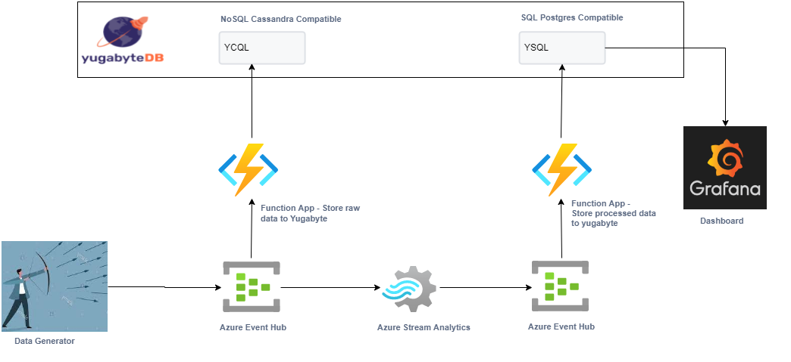

### Code in this repository is for building solution shown in picture below.



### Demo and code explanation is in this blog

# Deploying this app

## Create all resources - functionapps, eventhubs, stream job - using terraform

#### Update values.tfvars(use values.tfvars.sample as reference), located in terraform folder, for following values
```
"yugabyte.admin-user" =  
"yugabyte.admin-password" = 
"yugabyte.host" =  
"yugabyte.root-crt" =  <Use this command and then paste here - echo $(cat root.crt)>
```

#### Run terraform apply from `terraform` folder to create all resources and get connection string for eventhub NS. 
#### This connect string will be used by generator
```
terraform apply  -var-file=values.tfvars -auto-approve
terraform output source_connection_string
```

#### Deploy the functions code

> Read about func tools [here](https://docs.microsoft.com/en-us/azure/azure-functions/functions-core-tools-reference?tabs=v2#func-azure-functionapp-fetch-app-settings)
```
cd ../function-summary
func azure functionapp fetch-app-settings ybsummary # This creates local settings file from current app settings
func azure functionapp publish ybsummary
cd ../function-rawyb
func azure functionapp fetch-app-settings ybrawcql
func azure functionapp publish ybrawcql 
```
#### Start Stream Analytics Job 
```
az stream-analytics job start  --job-name CreateAggregate --resource-group eventshubrg
```

#### Create tables in Yugabyte cloud - https://cloud.yugabyte.com/
* Use definitions provided in resources/ybschema.txt

#### Now start your [generator](https://github.com/skamalj/datagenerator) based on cconfig file provided in resources folder

* Update EventHub connect string and eventhub name (which is "source" in this demo) in .env file of generator


## Upload the settings, if you make any changes,  back to Azure using below command for both functions (Run from corresponding function directory)
```
func azure functionapp publish ybrawcql --publish-settings-only
func azure functionapp publish ybsummary --publish-settings-only
```

## Create Stream Analytics Job from VSCODE
* Install Azure Stream Analytics Extension as described [here](https://docs.microsoft.com/en-us/azure/stream-analytics/quick-create-visual-studio-code)
* Open the project in VSCode
* Go To ASAYBSummary -> Inputs, and click on myeventhub.json.  Now click on the greyed text for each option to select your values
* Do same for output - YBSink.json
* No select ASAYBSummary.asaql and publish to azure

## Start / Stop ASA Job 
```
az stream-analytics job start  --job-name CreateAggregate --resource-group eventshubrg
az stream-analytics job stop  --job-name CreateAggregate --resource-group eventshubrg
```

## Create your grafana dashboard by importing the json file from resources folder. 
* You will have to setup your datasource for yugabyte SQL (Using PostgreSQL plugin)

## Clean UP
#### Stop Stream Analytics Job (Else terraform cannot delete the job)
```
az stream-analytics job stop  --job-name CreateAggregate --resource-group eventshubrg
```
#### Delete all resources
```
terraform destroy -auto-appprove -var-file=values.tfvars
```
